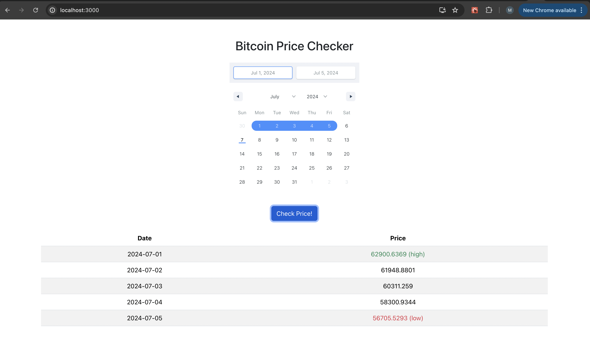

# Bitcoin Price Checker App

A demo application to check historical Bitcoin prices using the CoinDesk API. This full-stack application is built with Java, Spring Boot for the backend, and React for the frontend.



## Prerequisites

Before you begin, ensure you have met the following requirements:
- Java JDK 11 or later
- Maven 3.9.8 or later
- Node.js 13.12.0 or later
- Docker (for building and running Docker images)

## Setup

To set up the Bitcoin Price Checker App, follow these steps:

1. Clone the repository:
```bash
git clone https://github.com/mdsahil210/bitcoin-price-checker.git
```

2. Navigate to the project directory:
```bash
cd bitcoin-price-checker
```

## Continuous Integration and Deployment (CI/CD)

This project uses Jenkins for Continuous Integration and Continuous Deployment. The `Jenkinsfile` located in the root directory defines the pipeline stages that automate the process of building, testing, and deploying the application.

### Pipeline Overview

The Jenkins pipeline consists of the following stages:

1. **Build Maven**: This stage checks out the source code from the Git repository and uses Maven to build the backend Java/Spring Boot application.

2. **Build Docker Image**: In this stage, Docker images for both the backend and frontend are built. The backend image is built using the compiled Java application, and the frontend image is built from the React application's build artifacts.

3. **Push Image to Dockerhub**: After the Docker images are built, this stage logs into Docker Hub using credentials stored in Jenkins and pushes the images to a Docker Hub repository.

### Running the Pipeline

To run the pipeline, you need to have Jenkins set up with the necessary plugins (Git, Docker, Maven) and a configured agent capable of executing the pipeline steps. You also need to configure the credentials for accessing the Git repository and Docker Hub in Jenkins.

1. Add the project to Jenkins: Create a new item in Jenkins, select "Pipeline", and configure the source code management to point to your Git repository.

2. Configure credentials: Ensure you have added your Docker Hub credentials and Git credentials to Jenkins.

3. Run the pipeline: Trigger the pipeline manually or configure webhooks in your Git repository for automatic triggering on push events.

This CI/CD pipeline automates the testing, building, and deployment processes, ensuring that the application is always in a deployable state and facilitating rapid iterations.

### Backend Setup

1. Go to the `backend` directory:
```bash
cd backend
```

2. Build the project with Maven:
```bash
mvn clean install
```

### Frontend Setup

1. Navigate to the `frontend` directory:
```bash
cd ../frontend
```

2. Install dependencies:
```bash
npm install
```

3. Build the React application:
```bash
npm run build
```

## Running the Application

### Using Docker

1. Build Docker images for both backend and frontend from the project root directory:
```bash
docker build -t mdsahil210/bitcoin-price-checker-backend ./backend
docker build -t mdsahil210/bitcoin-price-checker-frontend ./frontend
```

2. Run the Docker containers:
```bash
docker run -d -p 8080:8080 mdsahil210/bitcoin-price-checker-backend
docker run -d -p 3000:3000 mdsahil210/bitcoin-price-checker-frontend
```

### Manually

- Backend: Navigate to the `backend` directory and run:
```bash
mvn spring-boot:run
```

- Frontend: Navigate to the `frontend` directory and run:
```bash
npm start
```

## Usage

After starting the application, you can access:
- The backend API at `http://localhost:8080`
- The frontend interface at `http://localhost:3000`

